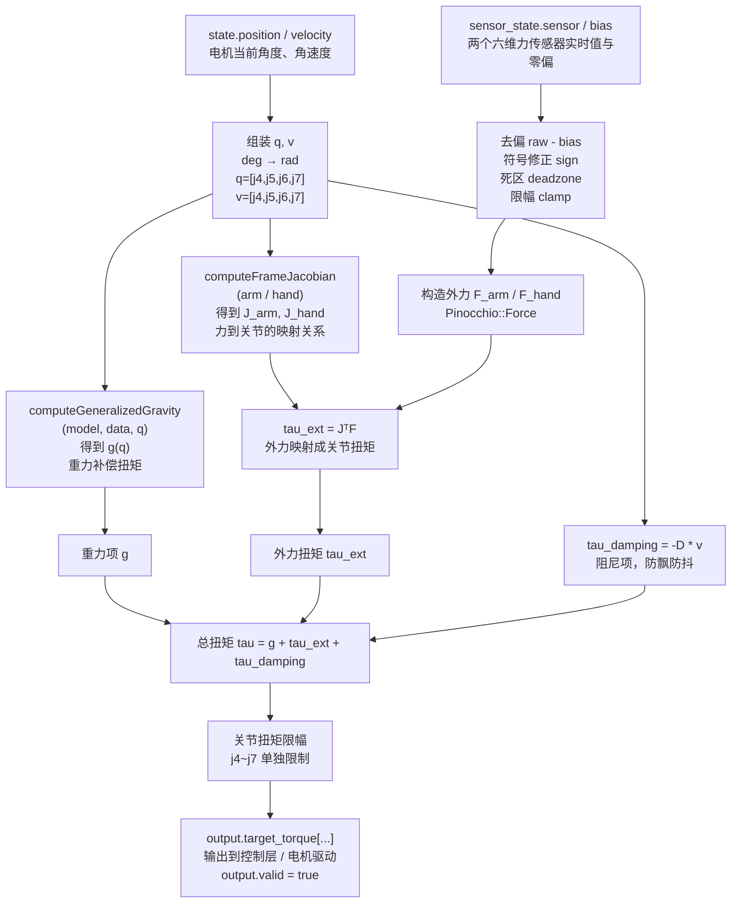

```mermaid
flowchart TD

A["state.position / velocity<br/>电机当前角度、角速度"]
--> B["组装 q, v<br/>deg → rad<br/>q=[j4,j5,j6,j7]<br/>v=[j4,j5,j6,j7]"]

B --> C["computeGeneralizedGravity<br/>(model, data, q)<br/>得到 g(q)<br/>重力补偿扭矩"]

B --> D["computeFrameJacobian<br/>(arm / hand)<br/>得到 J_arm, J_hand<br/>力到关节的映射关系"]

E["sensor_state.sensor / bias<br/>两个六维力传感器实时值与零偏"]
--> F["去偏 raw - bias<br/>符号修正 sign<br/>死区 deadzone<br/>限幅 clamp"]

F --> G["构造外力 F_arm / F_hand<br/>Pinocchio::Force"]

D --> H["tau_ext = JᵀF<br/>外力映射成关节扭矩"]
G --> H

C --> I["重力项 g"]
H --> J["外力扭矩 tau_ext"]

B --> K["tau_damping = -D * v<br/>阻尼项，防飘防抖"]

I --> L["总扭矩 tau = g + tau_ext + tau_damping"]
J --> L
K --> L

L --> M["关节扭矩限幅<br/>j4~j7 单独限制"]

M --> N["output.target_torque[...]<br/>输出到控制层 / 电机驱动<br/>output.valid = true"]
```

